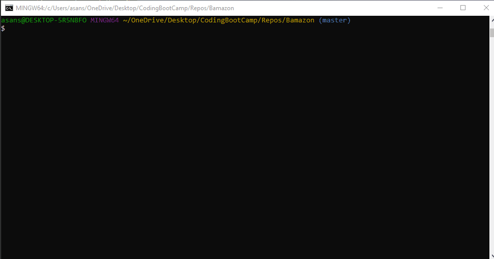

# Bamazon
A Node &amp; MySQL App

This app displays products that a user can "purchase". Once a selection is made, the quantity in stock of the product decreases by the number of items bought. The user can then buy something else or quit the program.

This was built with:
-MySQL
-Node
-Javascript

Demo:

